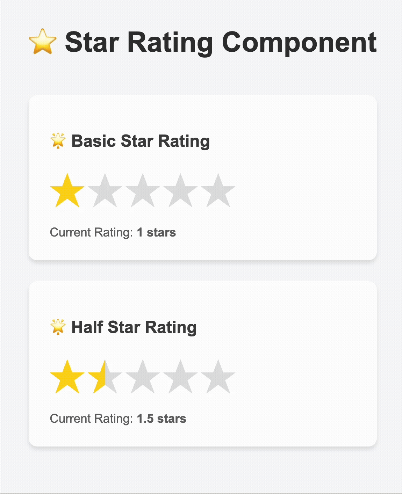
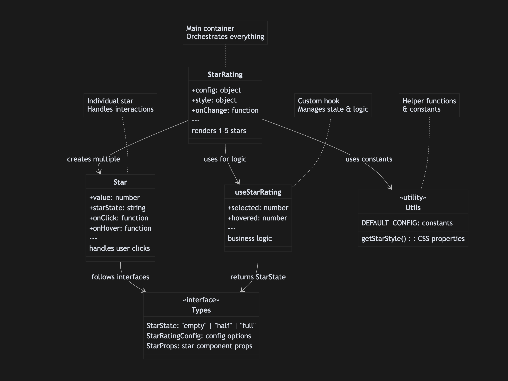

# ⭐ Star Rating Component - Interview Guide



## 📊 **Architecture Overview**



---

## 🏗️ **4-Step Architecture Breakdown**

### **Step 1: API Contract - Types & Interfaces**

```typescript
// StarRating/types.ts - Main component types
export interface StarRatingConfig {
  totalStars?: number;        // How many stars to display (default: 5)
  defaultValue?: number;      // Initial rating value
  enableHalfRating?: boolean; // Enable 0.5 increments (1.5, 2.5, etc.)
}

export interface StarRatingStyle {
  size?: number;              // Star size in pixels
  filledColor?: string;       // Color for selected stars
  emptyColor?: string;        // Color for unselected stars
}

export interface StarRatingProps {
  config?: StarRatingConfig;  // Configuration object
  style?: StarRatingStyle;    // Styling options
  onChange?: (rating: number) => void; // Callback when rating changes
}

export type StarState = 'empty' | 'half' | 'full'; // Visual states

// Star/types.ts - Individual star component types
export interface StarProps {
  value: number;                      // Star's numeric value (1, 2, 3...)
  starState: StarState;               // Current visual state
  enableHalfRating: boolean;          // Feature flag for half-stars
  starStyle: React.CSSProperties;     // Computed styles
  onHover: (value: number) => void;   // Mouse enter handler
  onLeave: () => void;                // Mouse leave handler
  onClick: (value: number) => void;   // Click handler
}
```

---

### **Step 2: Business Logic - Custom Hook**

The `useStarRating` hook contains all the business logic, separated from presentation:

```typescript
interface UseStarRatingProps {
  defaultValue: number;
  onChange?: (rating: number) => void;
}

export const useStarRating = ({ defaultValue, onChange }: UseStarRatingProps) => {
  const [selected, setSelected] = useState<number>(defaultValue);
  const [hovered, setHovered] = useState<number | null>(null);

  // Click handler - updates the actual rating
  const handleClick = (rating: number): void => {
    setSelected(rating);
    onChange?.(rating);
  };

  // Hover handlers - provide visual preview
  const handleMouseEnter = (rating: number): void => {
    setHovered(rating);
  };

  const handleMouseLeave = (): void => {
    setHovered(null);
  };

  // Core logic: Determines each star's visual state
  const getStarState = (value: number): StarState => {
    const currentRating = hovered !== null ? hovered : selected;
    if (currentRating >= value) return 'full';
    if (currentRating === value - 0.5) return 'half';  // Half-star logic
    return 'empty';
  };

  return {
    selected,
    hovered,
    handleClick,
    handleMouseEnter,
    handleMouseLeave,
    getStarState,    // Key function that determines visual states
  };
};
```

---

### **Step 3: Container Component - StarRating**

```typescript
import { DEFAULT_CONFIG } from '../../constants';
import { getStarStyle } from './utils/starUtils';

export const StarRating: React.FC<StarRatingProps> = ({
  config = {},
  style = {},
  onChange,
}) => {
  // Extract configuration with defaults from constants
  const {
    totalStars = DEFAULT_CONFIG.TOTAL_STARS,
    defaultValue = DEFAULT_CONFIG.DEFAULT_VALUE,
    enableHalfRating = DEFAULT_CONFIG.ENABLE_HALF_RATING,
  } = config;

  // Use our custom hook for all business logic
  const {
    handleClick,
    handleMouseEnter,
    handleMouseLeave,
    getStarState,
  } = useStarRating({ defaultValue, onChange });

  // Generate array of stars dynamically
  return (
    <div className="container" role="radiogroup" aria-label="Star rating">
      {Array.from({ length: totalStars }, (_, index) => {
        const starValue = index + 1;
        const starState = getStarState(starValue);
        const starStyle = getStarStyle(starState, style);

        return (
          <Star
            key={starValue}
            value={starValue}
            starState={starState}
            enableHalfRating={enableHalfRating}
            starStyle={starStyle}
            onHover={handleMouseEnter}
            onLeave={handleMouseLeave}
            onClick={handleClick}
          />
        );
      })}
    </div>
  );
};

// constants.ts - Centralized configuration
export const DEFAULT_CONFIG = {
  TOTAL_STARS: 5,
  DEFAULT_VALUE: 0,
  SIZE: 32,
  FILLED_COLOR: 'gold',
  EMPTY_COLOR: 'lightgray',
  ENABLE_HALF_RATING: false,
} as const;

// utils/starUtils.ts - Style computation logic
export const getStarStyle = (
  state: StarState, 
  style: StarRatingStyle = {}
): React.CSSProperties => {
  const size = style.size ?? DEFAULT_CONFIG.SIZE;
  const filledColor = style.filledColor ?? DEFAULT_CONFIG.FILLED_COLOR;
  const emptyColor = style.emptyColor ?? DEFAULT_CONFIG.EMPTY_COLOR;
  
  const starColor = state === 'full' ? filledColor : emptyColor;
  
  return {
    '--star-color': starColor,
    '--star-size': `${size}px`,
    '--filled-color': filledColor,
  } as React.CSSProperties;
};
```

---

### **Step 4: Presentation Component - Star**

```typescript
export const Star: React.FC<StarProps> = ({
  value, 
  starState,
  enableHalfRating,
  starStyle,
  onHover, 
  onLeave, 
  onClick,
}) => {
  
  // Keyboard accessibility handler
  const handleKeyPress = (e: React.KeyboardEvent, ratingValue: number) => {
    if (e.key === 'Enter' || e.key === ' ') {
      e.preventDefault();
      onClick(ratingValue);
    }
  };
  
  // Dynamic CSS classes based on state
  const starClasses = starState === 'half'
    ? `${styles.star} ${styles.halfStar}` 
    : styles.star;
    
  // Half-rating version: Split star into left/right halves
  if (enableHalfRating) {
    return (
      <span 
        className={starClasses}
        style={starStyle}
        onMouseLeave={onLeave}
        role="button"
        tabIndex={-1}
        aria-label={`Rate ${value} star${value !== 1 ? 's' : ''}`}
        aria-pressed={starState === 'full'}
      >
        <span 
          className={styles.leftHalf}
          onMouseEnter={() => onHover(value - 0.5)}
          onClick={() => onClick(value - 0.5)}
          onKeyDown={(e) => handleKeyPress(e, value - 0.5)}
          role="button"
          tabIndex={0}
          aria-label={`Rate ${value - 0.5} stars`}
        />
        <span 
          className={styles.rightHalf}
          onMouseEnter={() => onHover(value)}
          onClick={() => onClick(value)}
          onKeyDown={(e) => handleKeyPress(e, value)}
          role="button"
          tabIndex={0}
          aria-label={`Rate ${value} star${value !== 1 ? 's' : ''}`}
        />
        ★
      </span>
    );
  }

  // Simple version: Full star interactions
  return (
    <span
      className={starClasses}
      style={starStyle}
      onMouseEnter={() => onHover(value)}
      onMouseLeave={onLeave}
      onClick={() => onClick(value)}
      onKeyDown={(e) => handleKeyPress(e, value)}
      role="button"
      tabIndex={0}
      aria-label={`Rate ${value} star${value !== 1 ? 's' : ''}`}
      aria-pressed={starState === 'full'}
    >
      ★
    </span>
  );
};
```

---

### **CSS Implementation - Star Styling**

The styling uses CSS Modules with CSS custom properties for dynamic theming:

```css
.star {
  cursor: pointer;
  user-select: none;
  transition: color 0.2s ease;
  color: var(--star-color);      /* Dynamic color from JS */
  font-size: var(--star-size);   /* Dynamic size from JS */
  position: relative;
  display: inline-block;
}

.star:hover {
  transform: scale(1.1);  /* Hover animation */
}

/* Half-star visual effect using CSS pseudo-element */
.halfStar {
  position: relative;
  overflow: hidden;
}

.halfStar::before {
  content: '★';
  position: absolute;
  left: 0;
  top: 0;
  width: 50%;                    /* Only show left half */
  color: var(--filled-color);    /* Filled color for left half */
  overflow: hidden;
  z-index: 1;
}

/* Invisible interaction areas for precise half-star clicking */
.leftHalf,
.rightHalf {
  position: absolute;
  top: 0;
  width: 50%;
  height: 100%;
  cursor: pointer;
  z-index: 2;                    /* Above the visual star */
}

.leftHalf { left: 0; }
.rightHalf { right: 0; }
```

**How Half-Star Visual Effect Works:**

The half-star effect is created using CSS pseudo-elements. Here's the step-by-step breakdown:

```css
/* Step 1: Base star (shows empty/gray star) */
.halfStar {
  position: relative;    /* Creates positioning context */
  overflow: hidden;      /* Clips content that goes outside */
}

/* Step 2: Pseudo-element creates the "filled" half */
.halfStar::before {
  content: '★';                    /* Same star character */
  position: absolute;              /* Position over the base star */
  left: 0;                        /* Start from left edge */
  top: 0;                         /* Align with top */
  width: 50%;                     /* Only cover LEFT HALF */
  color: var(--filled-color);     /* Use filled color (gold) */
  overflow: hidden;               /* Clip anything outside */
  z-index: 1;                     /* Layer above base star */
}
```

**Visual Result:**
- **Base star**: Full gray star (★) in background
- **Pseudo-element**: Half gold star (★) overlaid on left 50%
- **Final effect**: Left half gold, right half gray = half-filled star!

**Why This Works:**
1. Both elements show the same star character (★)
2. Base star is gray and fills entire space
3. Pseudo-element is gold but only covers left 50%
4. Browser renders gold on top of gray, creating the half-filled illusion

**CSS Techniques Used:**
- **CSS Pseudo-elements**: `::before` creates additional visual element
- **CSS Custom Properties**: Dynamic theming with `var(--star-color)`
- **Absolute Positioning**: Precise overlay positioning
- **Width Control**: 50% width creates exact half coverage
